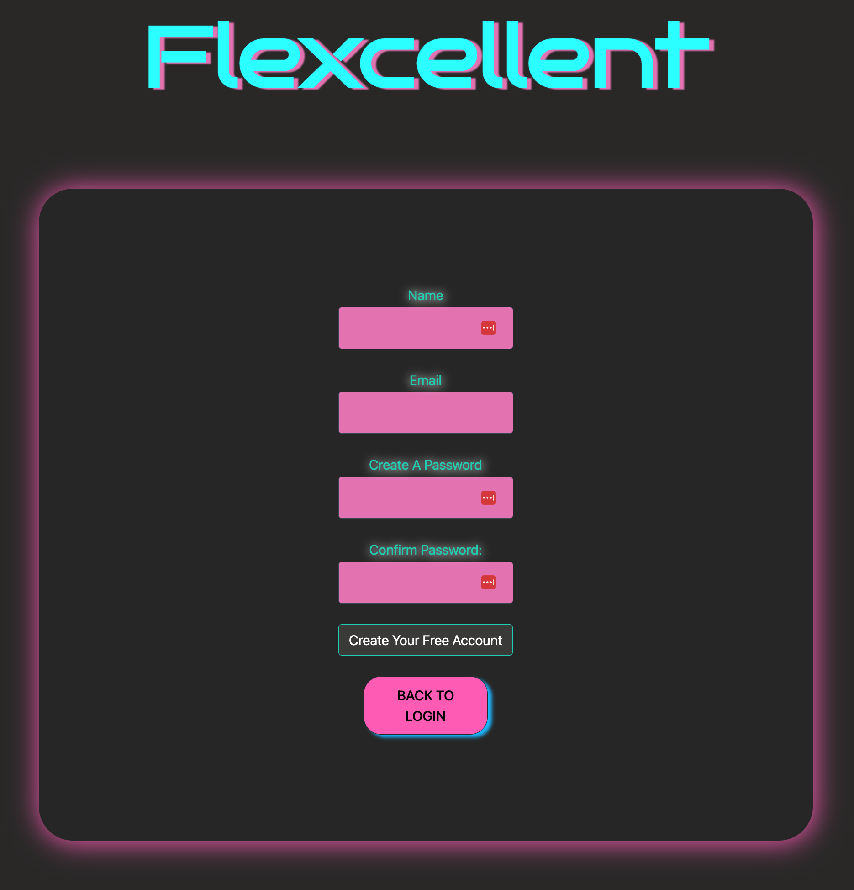

# Flexcellent Fitness Tracker 
Repo for the Flexcellent Fitness Tracker

## Description 
A fitness tracker that allows users to easily track their weight and workout history with a simple and intuitive interface. Users can store their weight history and view it on a dashboard, as well as add new measurements or edit previous ones. Historical workouts can be viewed, and new workouts with custom exercises, sets, reps, and equipment weight can be added. Users can also explore new exercises by muscle group or get random exercise suggestions.

**A *premium experience* is also available for  power users.**

## Table of Contents

* [Installation](#installation)
* [Usage](#usage)
* [Credits](#credits)
* [License](#license)
* [Features](#features)
* [Contributing](#contributing)
* [Tests](#tests)
* [Questions](#questions)

## Screenshot

## Installation 
N/A

## Usage 
1. Head to the ***[Flexcellent Website](https://flexcellent.herokuapp.com/)***. 
2. You can register a new account or login if you have an existing account. 
3. Once logged in, you can view your weight history on the dashboard and add new measurements or edit previous ones. 
4. Click on ***[Workouts](https://flexcellent.herokuapp.com/workouts)*** to view your workout history. 
    * Clicking *Add a Custom Workout* allows you to add a new workout with your own exercises, sets, reps, and equipment weight.
5. Clicking ***[Explore](https://flexcellent.herokuapp.com/explore)*** will take you to a page where you can browse exercise suggestions.
    * Explore new exercises by a desired muscle group, or...
    * Get random exercise suggestions. 
6. For an ***enhanced experience***, click *Premium Subscription Here*.

## Credits 
A big thank you to the Flexcellent team, without whom this project would not have been possible:
* [pbodybrooks](https://github.com/pbodybrooks)
* [ashtreid](https://github.com/ashtreid)
* [mkidee](https://github.com/mkidee)
* [CaptFlopp3y](https://github.com/CaptFlopp3y)

## License
This application is covered under the [MIT](https://opensource.org/licenses/MIT) license.

## Features 
This application is a full stack webpage that utilizes many technologies, including:
* [Node.js](https://nodejs.org/en/)
* [Express.js](https://expressjs.com/)
* [MySQL](https://www.mysql.com/)
* [Sequelize](https://sequelize.org/)
* [Handlebars.js](https://handlebarsjs.com/)
* [Bootstrap](https://getbootstrap.com/)
* [Pico.css](https://picocss.com/)
* [Font Awesome](https://fontawesome.com/)
* [Heroku](https://www.heroku.com/)
* [JawsDB](https://www.jawsdb.com/)
* [bcrypt](https://www.npmjs.com/package/bcrypt)
* [dotenv](https://www.npmjs.com/package/dotenv)
* [express-session](https://www.npmjs.com/package/express-session)
* [mysql2](https://www.npmjs.com/package/mysql2)
* [chart.js](https://www.chartjs.org/)

## Contributing 
N/A

## Tests 
N/A

## Questions 
You can find the Flexcellent team on GitHub at:
* [pbodybrooks](https://github.com/pbodybrooks)
* [ashtreid](https://github.com/ashtreid)
* [mkidee](https://github.com/mkidee)
* [CaptFlopp3y](https://github.com/CaptFlopp3y)
